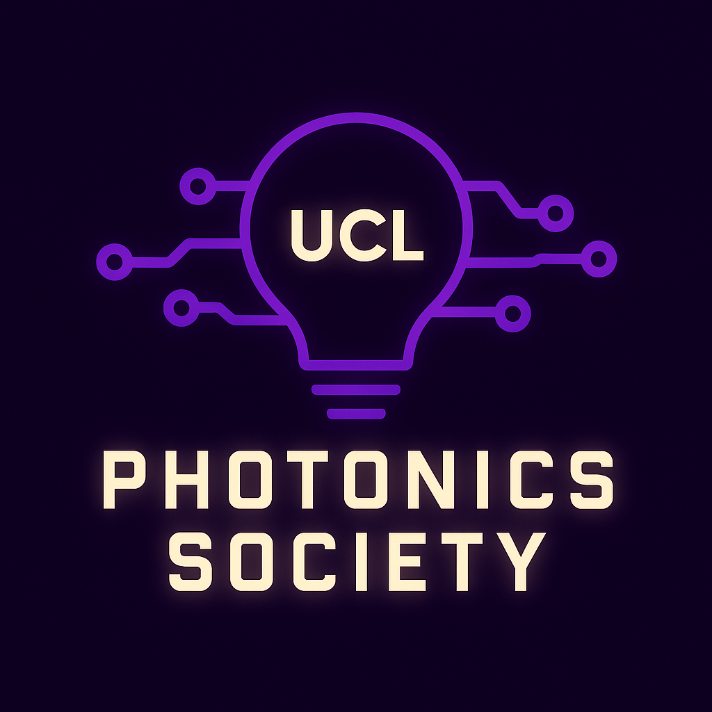
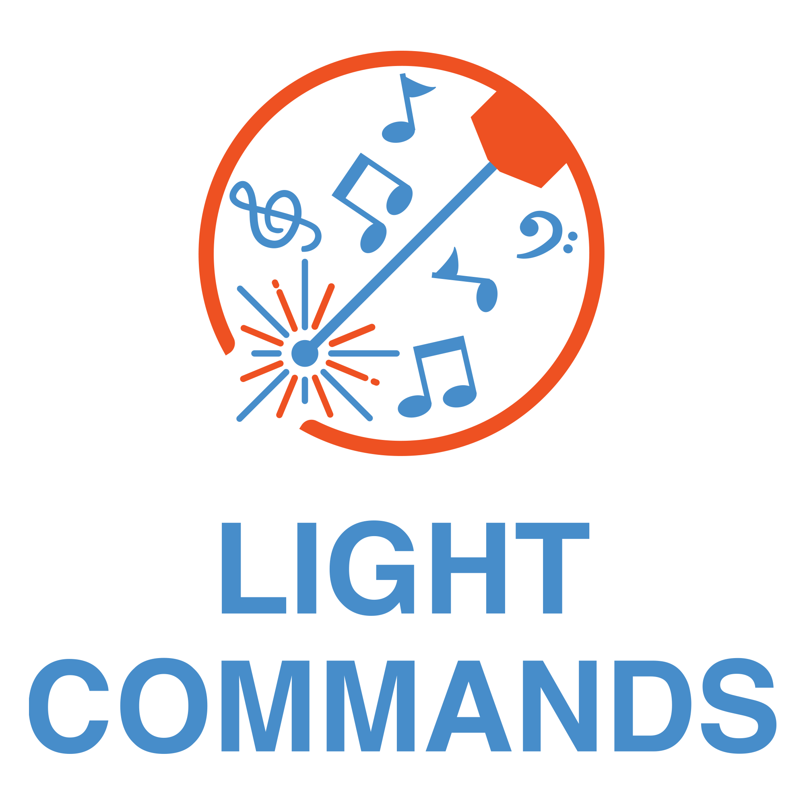
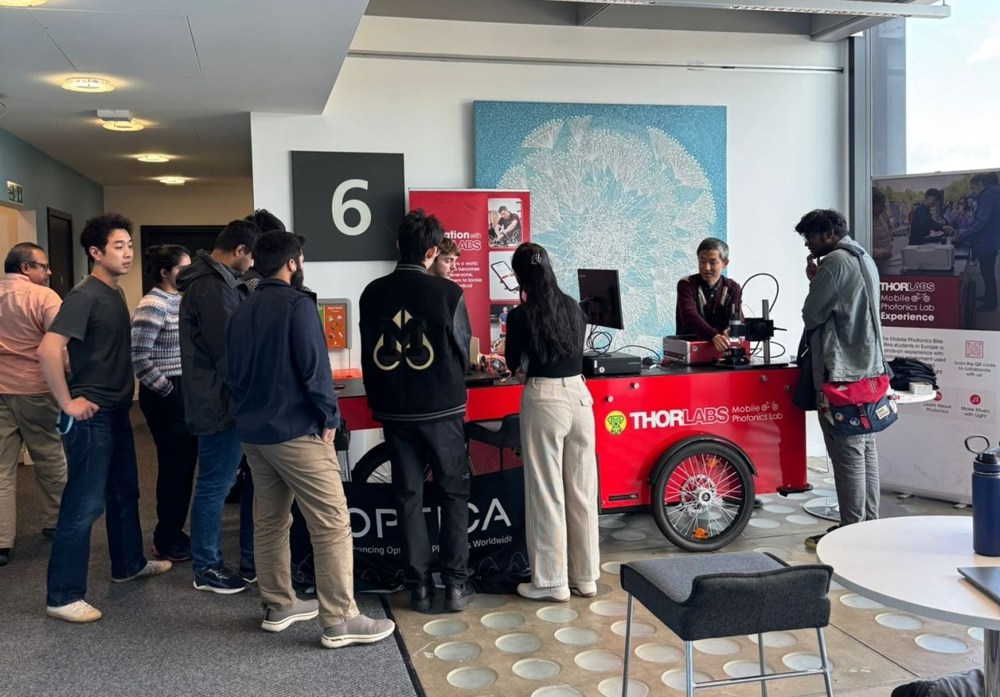
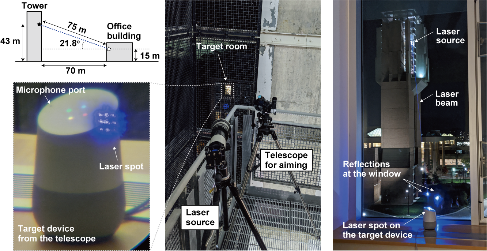
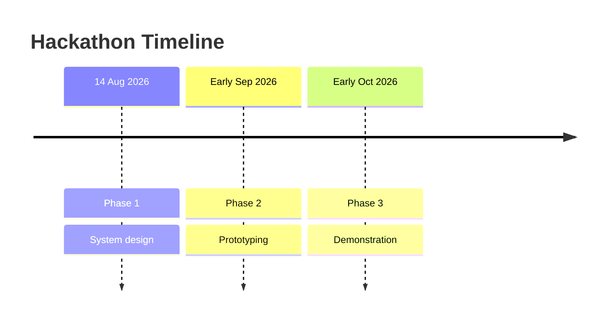

# 💡 UCLightcommands Hackathon

Welcome to the UCL Photonics Society x Thorlabs UK LightCommands hackathon website.

  
  
  

---

## ⚙️ The Hackathon

---

### 🥅 Goals

This hackathon is centred on real engineering: participants will not just learn concepts, but apply them under genuine constraints — a fixed set of available equipment, UCL safety regulations, and a hard deadline. The final product must also be explainable to a broad, non-technical audience on the day of the demonstration.

Concretely, the goals are to:

- Engineer a [LightCommands](https://arxiv.org/pdf/2006.11946) demonstration for the [Mobile Photonics Bike](https://www.thorlabs.com/mobile-photonics-lab---europe) using [Thorlabs](https://www.thorlabs.com/) equipment, compliant with UCL safety regulations.
- Prototype the system in collaboration with Thorlabs engineers and prepare for the demonstration.
- Engage with the community by performing the demonstration to a broad audience.

---

### 🚲 Thorlabs' Mobile Photonics Bike

As one of the top distributors of optical components in the world, [Thorlabs](https://www.thorlabs.com/) is commited to multiple initiatives aimed at making the field of Photonics more accecible. One of these initiatives is the [Mobile Photonics Bike](https://www.thorlabs.com/mobile-photonics-lab---europe), an easily maneuverable and eco-friendly mobile lab which transports interactive optics and photonics demonstrations to university campuses. 

<figure markdown="span">
  
  <figcaption>The Thorlabs Mobile Photonics Bike visiting UCL in October 2025</figcaption>
</figure>

The UCL Photonics Society hosted the Mobile Photonics Lab for the first time in October 2025, presenting demonstrations on Optical Coherence Tomography. This event was such a success that this year, Thorlabs offered us the possibility of designing our very own demo, which is the goal of this hackackathon!

---

### 🎙️ LightCommands

Light Commands is a [published research project](https://arxiv.org/pdf/2006.11946) describing a vulnerability in MEMS microphones where modulated light can be used to inject inaudible and invisible voice commands into systems such as Google Assistant, Amazon Alexa, Apple Siri, and Facebook Portal. In addition to their paper, the authors of this study created a [dedicated website](https://lightcommands.com/) with extensive resources to help others recreate their demonstrations and make them more accessible.

<figure markdown="span">
  
  <figcaption>Attack setup from the LightCommands paper — a modulated laser beam injecting voice commands into a smart speaker (Sugawara et al., 2020)</figcaption>
</figure>

This setup is what the UCL Photonics Society and Thorlabs have decided to build together to be demonstrated with the Thorlabs Mobile Bike.

---

### 🗓️ Structure

The hackathon is structured in three phases across the summer and autumn of 2026:

- **Phase 1 (14th of August, 2pm to 6pm)** — The team designs the full optical system: transmitter, receiver, and surrounding setup. All design decisions are documented and sent to Thorlabs for review.
- **Phase 2 (early September)** — The team travels to Thorlab's offices in Ely to meet with engineers and prototype the demonstration.
- **Phase 3 (early October)** — The Mobile Photonics Bike visits UCL and the LightCommands demonstration is performed live to a public audience.

---

### 👉 Registration

Please contact David Gerard (david.gerard.23@ucl.ac.uk) if you would like to participate to the hackathon, providing your GitHub username and a (very) short descrption of why you're interested in this project.

!!! info "Limitted capacity"
    This hackathon has a capacity of about 10 people, please let us know if you would be able to participate to all three phases.

---

## 🤍 The Organisers

---

### 💜 UCL Photonics Society

The UCL Photonics Society is a student society at University College London dedicated to promoting optics and photonics among students and the wider community. The society organises workshops, talks, and outreach events in collaboration with academic and industry partners, with the aim of making photonics accessible and exciting to all.

---

### ❤️ Thorlabs

[Thorlabs](https://www.thorlabs.com/) is a leading manufacturer and distributor of photonics equipment, supplying lasers, optics, optomechanics, and imaging systems to researchers and engineers worldwide. Through initiatives such as the Mobile Photonics Lab, Thorlabs actively supports photonics education and outreach at universities across Europe.
