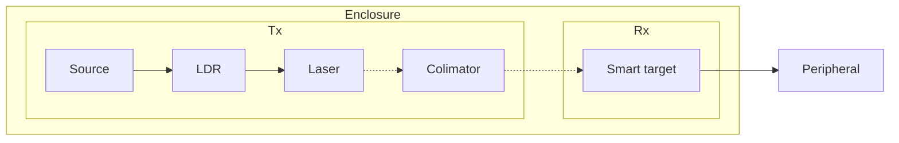

# Phase 1️⃣ — Final Report

## Demonstration Description

### Introduction

!!! question "What is the demonstration about? Describe it in a few sentences as if explaining to a non-specialist."

As a new demonstration for the [Mobile Photonics Bike](https://www.thorlabs.com/mobile-photonics-lab---europe), we propose **two setups** based on the [Light Commands study](https://lightcommands.com/) in which the injection of voice commands into smart appliences using a light source modulated with an audio signal.

The **first setup** would utilise a collimated LED as its light source, and target a microphone connected to an amplifer and oscilloscope. This demonstration is focused on the first principles of modulating a signal from one medium to another, and illustrating the notion of signal quality.

The **second setup** would utilise a laser source to activate a smart target (home assistant, smartphone...), reproducing the results of the [original study](https://arxiv.org/pdf/2006.11946). The choise of a laser source is justified by the variance in the reported minimum power required for voice command injection at 30cm distance for different devices, ranging from 0.5mW for a Google Home to 60mW for a Samsung Galaxy S9. Thus, this demo is initially designed for a worst case scenario of 60mW activation power, and is designed to be fully enclosed to maximise safety.  

---

### Pedagogical Goals

!!! question "What concepts in optics and photonics does this demonstration illustrate? What should a member of the public take away from it?"

- **Showcase** how a signal carrying information (in our case a voice command) can be carried over different media (accoustic, electronic, optical), and what mechanisms are used to convert from one medium to another (microphone, optical modulation).
- **Introduce** the notion of *signal to noise ratio*, **explain** how the power per surface area at the target impacts this metric, and **demonstrate** what influences this metric (input power, beam focus, distance to target). 

---

### Session Description

!!! question "Describe what a typical session looks like: how is the equipment set up, what does the demonstrator do, what does the audience see and interact with?"

**Setup**

- The team sets up the two demos on opposite ends of the Mobile Photonics Lab, and performs the necessary alignment using personal protective equipment (PPE).
- Before the sessions starts, all the features of the demos are tested as a final rehersal, with particular emphasis on testing laser safety features.

**Demo 1 - LED light source to Microphone**

1. A signal (coming from a microphone, a recorded audio, or a signal generator) is modulated onto the light of a collimated LED and directed onto a microphone connected to an amplifer and an oscilloscope, which is used to visualise the received signal.
2. By changing the input power of the LED and/or the beam width, the impact of these parameters on the signal quality is illustrated.

**Demo 2 - Laser light source to Smart Target**

1. With the enclosure opened, the different components of the demonstration are explained to the attendees.
2. After closing the enclosure, the laser source is turned on, and a voice command signal (coming from a microphone or a recorded audio file) is modulated onto the amplitude of the continuous wave, hitting the microphone of a smart target (Smartphone or home assistant).
3. By changing the input power of the laser, the notion of the minimum activation power is demonstrated.

---

## Parts List

### System Description

!!! question "Provide a high-level description of the full system architecture: how do the transmitter, receiver, and surrounding hardware work together?"

**Demo 1 - LED light source to Microphone**

**Demo 2 - Laser light source to Smart Target**

---

### Transmitter Parts

!!! question "List all parts used in the transmitter (Tx), including model numbers where known."

| Demo | Part | Model / Reference | Notes |
|------|------|-------------------|-------|
| **1** | Diaphragme | [CP20D](https://www.thorlabs.com/item/CP20D?aID=51bff524c92ec93e4ab0b4d2f620ccca&aC=1)| Used as an aditional control for LED Power|
| **2** | | | |

---

### Receiver Parts

!!! question "List all parts used in the receiver (Rx), including the target voice-activated device and any supporting hardware."

| Demo | Part | Model / Reference | Notes |
|------|------|-------------------|-------|
| **1** | | | |
| **2** | | | |

---

### Other Parts (Mounts, Enclosure, etc.)

!!! question "List all remaining parts: optical mounts, breadboard, enclosure, cables, and anything else required to assemble the full system."

| Demo | Part | Model / Reference | Notes |
|------|------|-------------------|-------|
| **1&2** | Optical breadboards (x2) | [MB4560/M](https://www.thorlabs.com/item/MB4560_M) | The enclosure for demo 2 is 525mmx375mm, but demo 1 could use a smaller breadboard |
| **2** | Enclosure | [XE25C11D/M](https://www.thorlabs.com/item/XE25C11D_M) or [XE25C9D/M](https://www.thorlabs.com/item/XE25C9D_M) | |
| **2** | Laser Safety Panel | [LWxP1](https://www.thorlabs.com/certified-laser-safety-panels)| Choice will depend on the laser's wavelength |
| **2** | Interlock system | [Interlock Switch](https://www.amazon.co.uk/Gebildet-pieces-Miniature-Switch-Momentary/dp/B07T9DWMMG/ref=asc_df_B07T9DWMMG?mcid=f01cee05a660392c83d310c43db39473&tag=googshopuk-21&linkCode=df0&hvadid=697363582268&hvpos=&hvnetw=g&hvrand=12826283976019115331&hvpone=&hvptwo=&hvqmt=&hvdev=c&hvdvcmdl=&hvlocint=&hvlocphy=9045885&hvtargid=pla-783906794563&hvocijid=12826283976019115331-B07T9DWMMG-&hvexpln=0&gad_source=1&th=1) + [2.5mm jack connector](https://www.digikey.co.uk/en/products/detail/tensility-international-corp/053-0280R/701163?gclsrc=aw.ds&gad_source=1&gad_campaignid=23249465655&gbraid=0AAAAADrbLlgrKaT7nPn8TNfSxlsX8dlEd&gclid=Cj0KCQjwv4XUBhDBARIsAE6bQUSy7EdxlOymtTAqSwjYG2OdEJeFpZBuJbX0XvQ_-qaeP-_sBIK-icoaAg55EALw_wcB) | Thorlabs laser drivers seem to all use 2.5mm jack interlock inputs |

---

## UCL Risk Assessment

!!! question "Complete the UCL risk assessment for the demonstration. Identify each hazard, its likelihood and severity, and the mitigations in place."

**Answer**

| Hazard | Likelihood | Severity | Mitigation |
|--------|-----------|---------|------------|
| | | | |

!!! warning "This section must be approved by UCL before the demonstration can take place."
