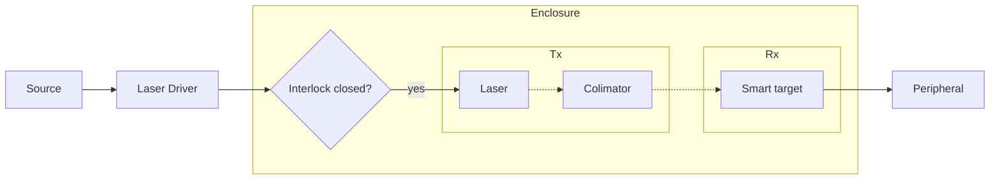

# Phase 1️⃣ — Final Report

## Demonstration Description

### Introduction

!!! question "What is the demonstration about? Describe it in a few sentences as if explaining to a non-specialist."

As a new demonstration for the [Mobile Photonics Bike](https://www.thorlabs.com/mobile-photonics-lab---europe), we propose **two setups** based on the [Light Commands study](https://lightcommands.com/) in which the injection of voice commands into smart appliences using a light source modulated with an audio signal.

The **first setup** would utilise a collimated LED as its light source, and target a microphone connected to an amplifer and oscilloscope. This demonstration is focused on the first principles of modulating a signal from one medium to another, and illustrating the notion of signal quality.

The **second setup** would utilise a laser source to activate a smart target (home assistant, smartphone...), reproducing the results of the [original study](https://arxiv.org/pdf/2006.11946). The choise of a laser source is justified by the variance in the reported minimum power required for voice command injection at 30cm distance for different devices, ranging from 0.5mW for a Google Home to 60mW for a Samsung Galaxy S9. Thus, this demo is initially designed for a worst case scenario of 60mW activation power, and is designed to be fully enclosed to maximise safety.  

---

### Pedagogical Goals

!!! question "What concepts in optics and photonics does this demonstration illustrate? What should a member of the public take away from it?"

- **Showcase** how a signal carrying information (in our case a voice command) can be carried over different media (accoustic, electronic, optical), and what mechanisms are used to convert from one medium to another (microphone, optical modulation).
- **Introduce** the notion of *signal to noise ratio*, **explain** how the power per surface area at the target impacts this metric, and **demonstrate** what influences this metric (input power, beam focus, distance to target). 

---

### Session Description

!!! question "Describe what a typical session looks like: how is the equipment set up, what does the demonstrator do, what does the audience see and interact with?"

**Setup**

- The team sets up the two demos on opposite ends of the Mobile Photonics Lab, and performs the necessary alignment using personal protective equipment (PPE).
    - Laser alignment is performed at minimum power using an IR card.
- Before the sessions starts, all the features of the demos are tested as a final rehersal, with particular emphasis on testing laser safety features.

**Demo 1 - LED light source to Microphone**

1. A signal (coming from a microphone, a recorded audio, or a signal generator) is modulated onto the light of a collimated LED and directed onto a microphone connected to an amplifer and an oscilloscope, which is used to visualise the received signal.
2. By changing the input power of the LED and/or the beam width, the impact of these parameters on the signal quality is illustrated.

**Demo 2 - Laser light source to Smart Target**

1. With the enclosure opened, the different components of the demonstration are explained to the attendees.
2. After closing the enclosure, the laser source is turned on, and a voice command signal (coming from a microphone or a recorded audio file) is modulated onto the amplitude of the continuous wave, hitting the microphone of a smart target (Smartphone or home assistant). We envision this smart target to be connected to a peripheral (such as a smart lamp) to make the demonstration more interactive.
3. By changing the input power of the laser, the notion of the minimum activation power is demonstrated.

---

## Parts List

### System Description

!!! question "Provide a high-level description of the full system architecture: how do the transmitter, receiver, and surrounding hardware work together?"

Both demos share the same underlying signal chain: an electrical audio signal is used to drive the optical output power of a light source (LED or laser), which is shaped and aimed by free-space optics, then converted back into an electrical/acoustic signal by a MEMS microphone diaphragm at the receiver.

**Demo 1 - LED light source to Microphone**

The **transmitter (Tx)** takes an audio signal from one of three interchangeable sources — a live microphone, a pre-recorded voice command, or a signal generator (used to inject test tones for the SNR demonstration) — and feeds it to an **LED driver**, which converts the electrical waveform into a proportional drive current. This modulates the optical output power of the **LED** in amplitude, encoding the audio signal onto the light itself. A **diaphragm** placed after the LED acts as an adjustable aperture, giving a second, independent control over the optical power reaching the target (in addition to the LED driver's electrical gain). A **collimator** then narrows the diverging LED output into a roughly parallel beam so that optical power stays concentrated over the free-space path to the receiver.

The **receiver (Rx)** is simply a **microphone and amplifier**: the modulated light strikes the microphone's diaphragm directly, which responds to the intensity fluctuations of the light in the same way it would to an acoustic pressure wave (the same photoacoustic/photothermal coupling exploited in the original LightCommands attack). The amplifier boosts this recovered signal and feeds it to an **oscilloscope**, so the audience can directly see the transmitted waveform being reconstructed. Because every stage (source, LED driver, diaphragm aperture, collimation, distance) is exposed and independently adjustable, this setup is used to illustrate how each parameter affects **signal-to-noise ratio** at the receiver.

**Demo 2 - Laser light source to Smart Target**

Demo 2 follows the same source → driver → emitter → collimator → receiver logic as Demo 1, but replaces the LED with a **laser** to reach the higher optical power which might be needed to activate a real device, and replaces the exposed microphone with a **smart target** (smartphone or home assistant). The laser driver, laser, and collimator direct a modulated beam across a short free-space path onto the smart target's built-in MEMS microphone, which decodes the light modulation as if it were a spoken voice command. Once the target's voice assistant recognises the injected command, it drives a connected **peripheral** (e.g. a smart plug, light, or the device's own speaker/screen) to visibly confirm activation to the audience.

Because the laser is driven at powers up to the worst-case 60 mW design point, the entire **Tx** and **Rx** are housed inside a shared **enclosure**, integrating a **laser safety panel** (rated to the source's wavelength) and an **interlock switch**  wired into the laser driver's interlock input.  This lets the demonstrator open the enclosure to explain the components to the audience, then close it before energising the laser, keeping the beam fully contained during operation. 

---

### Transmitter Parts

!!! question "List all parts used in the transmitter (Tx), including model numbers where known."

| Demo | Part | Model / Reference | Notes |
|------|------|-------------------|-------|
| **1** | LED Driver | [CD40](https://www.thorlabs.com/4.0-a-led-driver) or [T-Cube™ LED Driver](https://www.thorlabs.com/t-cube-tm-led-driver) | Modulation input connected to analogue source delivering a 0-5V signal. |
| **1** | LED | [M450LP2](https://www.thorlabs.com/item/M450LP2) | Need a visible light LED which can achieve resonably high power in order to achieve reasonable SNR|
| **1** | LED Cage Plate mount with SM1 thread | [CP33/M](https://www.thorlabs.com/item/CP33_M) | |
| **1** | Diaphragme with SM1 threads | [SM1D12](https://www.thorlabs.com/item/SM1D12)| Used as an aditional control for LED Power|
| **1** | Collimation adaptor with SM1 thread| [SM1U25-A](https://www.thorlabs.com/item/SM1U25-A) | Preferably a zoom housing in order to desmonstrate the impact of beam focus on received signal.|
| **2** | Laser Driver | [LDC205C](https://www.thorlabs.com/item/LDC205C) | Modulation input connected to analogue source delivering a 0-5V signal, and interlock pin connected to interlock lever swich.|
| **2** | 980 nm IR Laser diode (PIN code A) | [L980P100A](L980P100A) | The 100mW max power of this diode covers the activation power worst case scenario, |
| **2** | Strain relief cable Pin A to DB8| [SR9A-DB9](https://www.thorlabs.com/item/SR9A-DB9) | Need the correct pin code.|
| **2** | Cage Plate Collimation Mount | [LDH56-P2/M](https://www.thorlabs.com/item/LDH56-P2_M) | |

---

### Receiver Parts

!!! question "List all parts used in the receiver (Rx), including the target voice-activated device and any supporting hardware."

| Demo | Part | Model / Reference | Notes |
|------|------|-------------------|-------|
| **1** | | | |
| **2** | | | |

---

### Other Parts (Mounts, Enclosure, etc.)

!!! question "List all remaining parts: optical mounts, breadboard, enclosure, cables, and anything else required to assemble the full system."

| Demo | Part | Model / Reference | Notes |
|------|------|-------------------|-------|
| **2** | NIR Detector Card | [VRC7](https://www.thorlabs.com/item/VRC7) | Used at low power to align the laser with the target and demonstrate the presence of IR light. |
| **2** | Enclosure | [XE25C11T/M](https://www.thorlabs.com/item/XE25C11T_M) | Top open, with laser safety panel facing the public.|
| **2** | Laser Safety Panel | [LW2P2/M](https://www.thorlabs.com/item/LW1P2_M)| Optical density = 6 at 980nm (Transmission = 10^-4%)|
| **2** | Interlock system | [Interlock Switch](https://www.amazon.co.uk/Gebildet-pieces-Miniature-Switch-Momentary/dp/B07T9DWMMG/ref=asc_df_B07T9DWMMG?mcid=f01cee05a660392c83d310c43db39473&tag=googshopuk-21&linkCode=df0&hvadid=697363582268&hvpos=&hvnetw=g&hvrand=12826283976019115331&hvpone=&hvptwo=&hvqmt=&hvdev=c&hvdvcmdl=&hvlocint=&hvlocphy=9045885&hvtargid=pla-783906794563&hvocijid=12826283976019115331-B07T9DWMMG-&hvexpln=0&gad_source=1&th=1) + [2.5mm jack connector](https://www.digikey.co.uk/en/products/detail/tensility-international-corp/053-0280R/701163?gclsrc=aw.ds&gad_source=1&gad_campaignid=23249465655&gbraid=0AAAAADrbLlgrKaT7nPn8TNfSxlsX8dlEd&gclid=Cj0KCQjwv4XUBhDBARIsAE6bQUSy7EdxlOymtTAqSwjYG2OdEJeFpZBuJbX0XvQ_-qaeP-_sBIK-icoaAg55EALw_wcB) | Thorlabs laser drivers seem to all use 2.5mm jack interlock inputs |
| **1&2** | Optical breadboards (x2) | [MB4560/M](https://www.thorlabs.com/item/MB4560_M) | The enclosure for demo 2 is 525mmx375mm, but demo 1 could use a smaller breadboard |

---

## UCL Risk Assessment

!!! question "Complete the UCL risk assessment for the demonstration. Identify each hazard, its likelihood and severity, and the mitigations in place."

**Laser classification (Setup 2)**

The [L980P100A](L980P100A) diode used in Setup 2 emits up to 100 mW CW at 980 nm. Per [BS EN 60825-1](https://www.gov.uk/government/publications/laser-radiation-safety-advice/laser-radiation-safety-advice#fn:2), a bare/embedded emitter at this wavelength and power is a **Class 3B laser**: it is well above the Class 1/1M/2/2M/3R accessible emission limits for the near-infrared, but stays below the 500 mW CW threshold separating Class 3B from Class 4. Class 3B means direct intrabeam viewing and specular reflections are hazardous to the eye (and, to a lesser extent, the skin), while diffuse reflections are normally safe.

Because the laser diode, and beam path are fully housed inside the interlocked [enclosure](#other-parts-mounts-enclosure-etc), the demonstration as a whole is designed and operated as a **Class 1 laser product**: under normal operating conditions (enclosure closed, interlock made), there is no accessible emission above Class 1 limits anywhere the audience or demonstrators can be. The embedded Class 3B engine is only ever accessible with the enclosure open, during which the laser is de-energised or run at minimum power for alignment, as described in the [Session Description](#session-description).

**Safety measures in place for Setup 2**

- **Full enclosure** ([XE25C11T/M](https://www.thorlabs.com/item/XE25C11T_M)) housing the entire beam path from laser to target, so the 980 nm beam is never accessible during normal operation.
- **Hardware interlock** (switch + 2.5 mm jack wired into the [LDC205C](https://www.thorlabs.com/item/LDC205C) driver's interlock input) that disables laser emission the instant the enclosure is opened — enforced by the driver itself, not by software or operator discipline.
- **Laser safety panel** ([LW2P2/M](https://www.thorlabs.com/item/LW1P2_M), OD 6 at 980 nm, i.e. transmission ≈ 10⁻⁴ %) facing the public, attenuating any residual/scattered light to well below Class 1 exposure limits even if viewed directly.
- **Low-power alignment procedure**: the beam is invisible (980 nm), so alignment and re-alignment are always performed at minimum drive current using the [VRC7](https://www.thorlabs.com/item/VRC7) NIR detector card to visualise the beam, never by eye.
- **Trained operators only**: the laser is powered up and adjusted only by briefed demonstrators; the public only ever interacts with the smart target and its peripheral, never with the beam path itself.
- **Pre-session checks**: interlock function and enclosure integrity are tested as part of the final rehearsal before every session (see [Session Description](#session-description)).

| Hazard | Likelihood | Severity | Mitigation |
|--------|-----------|---------|------------|
| Direct or specularly-reflected exposure to the Class 3B, 980 nm laser beam (eye/skin injury) | Low | High | Beam fully enclosed during operation; hardware interlock cuts laser power the instant the enclosure is opened; alignment done at minimum power with an IR detector card, never by eye. |
| Interlock failure or bypass, allowing the enclosure to be opened while the laser is energised | Low | High | Interlock wired directly into the driver's hardware interlock input (fails safe, not software-controlled); function-tested before every session as part of the final rehearsal. |
| Residual beam or reflection escaping via the enclosure's open top | Low | Medium | Beam path kept low within the enclosure, well below the top rim; laser safety panel attenuates the forward-facing side; demonstrators do not reach over the open top while the laser is energised; warning signage on the enclosure. |
| Invisible (980 nm) beam causing unaware exposure during setup/alignment | Low | Medium | NIR detector card ([VRC7](https://www.thorlabs.com/item/VRC7)) used to visualise and align the beam at minimum power before any full-power operation; PPE (IR-rated laser safety eyewear) worn during alignment. |
| Electric shock or fire from mains-powered laser/LED drivers, amplifier, and oscilloscope | Low | Medium | Only PAT-tested Thorlabs/lab bench equipment used; cables routed and strain-relieved away from foot traffic; all equipment powered down between sessions; no modification of mains wiring. |
| Manual handling injury while lifting/mounting the optical breadboards and enclosure onto the Mobile Photonics Bike | Medium | Medium | Two-person lift for breadboards and enclosure; equipment secured to the bike's designed mounting points before travel; team briefed on manual handling technique beforehand. |
| Trip or entanglement hazard from cabling and equipment in a public walkway | Medium | Low | Cables routed behind the breadboards and taped down; demonstration area kept clear of the public path; demonstrators stationed at each setup throughout the session. |
| Unsupervised public contact with laser hardware or its enclosure | Low | Medium | Enclosure keeps all laser hardware inaccessible to the public; a demonstrator is present at Setup 2 at all times; public interaction limited to the peripherals outside the enclosure. |
| Eye exposure to the visible LED beam in Setup 1 | Low | Low | LED (Class 1/2 equivalent, well below laser AELs); beam intentionally aimed away from the public; brief, supervised exposure only. |

!!! warning "This section must be approved by UCL before the demonstration can take place."
