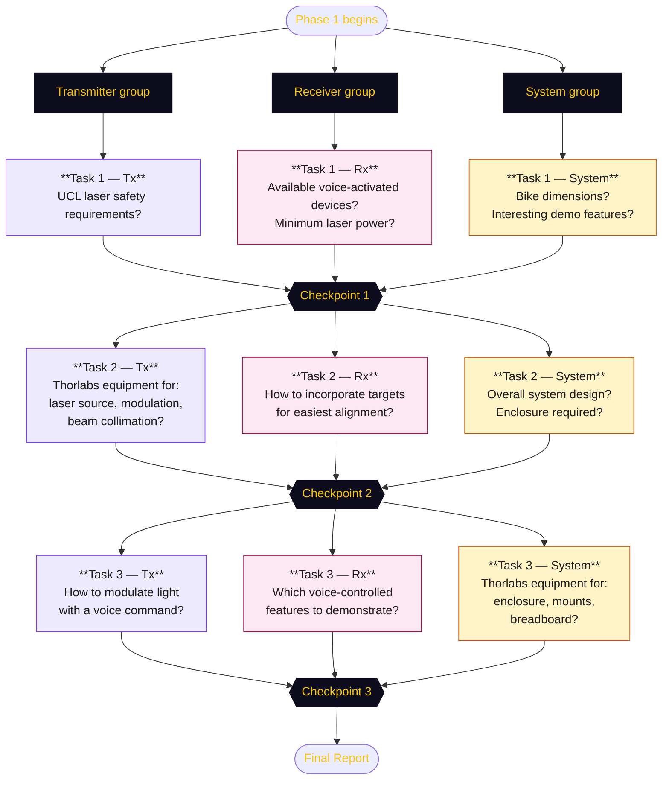
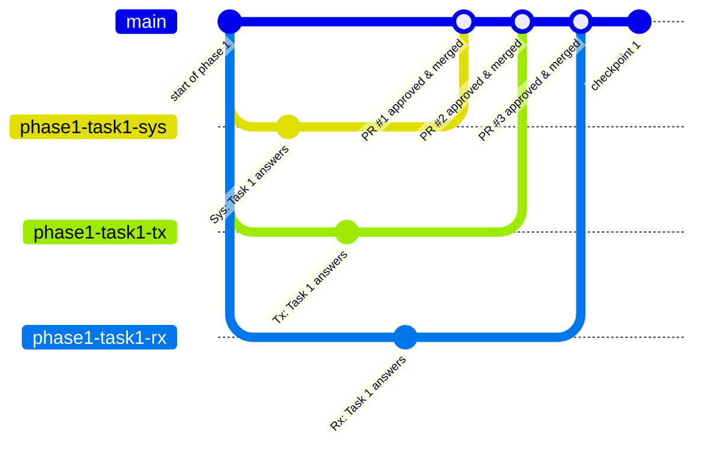

# Phase 1️⃣ — Tasks


## 🤖 Groups

Participants are split into three groups — **Transmitter**, **Receiver**, and **System** — and work in parallel across three tasks. Each task concludes with a checkpoint where all groups share progress and align on design decisions.



## 📝 Answering the tasks

Answers to each task's questions must be committed to this repository so progress is visible to everyone and the final report can be built from the documented work.

### 1. Get access to the repository

Each participant must be added as a contributor to the GitHub repository before they can push code. Ask the organiser to add your GitHub username to the repository with **Write** access:

[github.com/UCL-Photonics-Society/UCLightcommands](https://github.com/UCL-Photonics-Society/UCLightcommands)

### 2. Branch → Commit → Pull Request

The `main` branch is [protected](https://docs.github.com/en/repositories/configuring-branches-and-merges-in-your-repository/managing-protected-branches/about-protected-branches), meaning it cannot be modified directly. Instead, the branch-based workflow for every contribution is shown below: all three groups work in parallel on their own branches, then each branch is reviewed through a [pull request](https://docs.github.com/en/pull-requests/reference/pull-requests) and merged into `main` independently.



The step-by-step for your own contribution:

1. **[Create a branch](https://docs.github.com/en/pull-requests/how-tos/commit-changes/managing-branches-within-your-repository)** from `main`, named after your task and group, e.g. `phase1-task1-tx`
    ```bash
    git fetch
    git checkout phase1-task1-tx
    ```

2. **Edit the relevant page** in `docs/` and save your changes.

3. **[Add](http://github.com/git-guides/git-pull) and [Commit](https://github.com/git-guides/git-commit)** with a short, descriptive message:
    ```bash
    git add docs/phase1/tasks.md
    git commit -m "Add Tx answers for Phase 1 Task 1"
    ```

4. **[Push](https://github.com/git-guides/git-push)** your branch to GitHub:
    ```bash
    git push -u origin phase1-task1-tx
    ```

5. **Open a [Pull Request](https://docs.github.com/en/pull-requests/reference/pull-requests)** on GitHub from your branch into `main`. Write a brief description of what you've added.

### 3. Formatting your answers

Answers are written in Markdown. If you are unfamiliar with the syntax used on this site, refer to the [MkDocs Material reference](https://squidfunk.github.io/mkdocs-material/reference/).

### 4. Review and merge

All pull requests require **organiser approval** before they can be merged into `main`. Once approved, the PR is merged and the website updates automatically via GitHub Pages.

!!! info "If main has moved on since you created your branch"
    Other groups' PRs may have been merged into `main` while you were working. Before pushing, bring your branch up to date with a rebase:

    ```bash
    git fetch origin
    git rebase origin/main
    ```

    If git reports conflicts, open the affected file, find the `<<<<<<` markers, resolve them manually, then continue:

    ```bash
    git add docs/phase1/overview.md
    git rebase --continue
    ```

    Once the rebase is clean, `git push --force-with-lease` to update your remote branch.

---

## 📚 Resources

- [Light Commands website](https://lightcommands.com/).
- [Thorlabs website](https://www.thorlabs.com/).
- [UCL Artificial Optical Radiation (AOR) Safety Standard](https://www.ucl.ac.uk/safety-services/policies/2024/feb/ucl-artificial-optical-radiation-aor-safety-standard).
- [UCL Risk Assessment Standard](https://www.ucl.ac.uk/safety-services/policies/2022/sep/risk-assessment-standard).
- [MkDocs Material reference](https://squidfunk.github.io/mkdocs-material/reference/).

---

## Task 0️⃣ — Join your group


<!-- TODO: Alert block which states that this tasks will be demoed by the organisers -->

Each group leader registers all of their group's members on the [Overview page](overview.md). Only the leader contributes to this task to avoid merge conflicts on the same file.

=== "System"

    **1. Create the branch on GitHub**

    Open the repository on GitHub, click the branch dropdown (showing `main`), type `phase1-task0-sys` in the search field, then click **Create branch: phase1-task0-sys from 'main'**.

    **2. Fetch and checkout the branch**

    ```bash
    git fetch origin
    git checkout phase1-task0-sys
    ```

    **3. Add all group members**

    Open `docs/phase1/overview.md` and replace the placeholder under the **System** tab of `## Participants` with your group's names:

    ```markdown
    === "System"

        - Alice Smith
        - Bob Jones
    ```

    **4. Commit, push, and open a PR**

    ```bash
    git add docs/phase1/overview.md
    git commit -m "Add System group members"
    git push
    ```

    Then open a Pull Request on GitHub from `phase1-task0-sys` into `main`.

    !!! warning "Wait for approval"
        The PR must be approved by the organiser before it is merged. Do not merge it yourself.

=== "Transmitter (Tx)"

    **1. Create the branch on GitHub**

    Open the repository on GitHub, click the branch dropdown (showing `main`), type `phase1-task0-tx` in the search field, then click **Create branch: phase1-task0-tx from 'main'**.

    **2. Fetch and checkout the branch**

    ```bash
    git fetch origin
    git checkout phase1-task0-tx
    ```

    **3. Add all group members**

    Open `docs/phase1/overview.md` and replace the placeholder under the **Transmitter (Tx)** tab of `## Participants` with your group's names:

    ```markdown
    === "Transmitter (Tx)"

        - Alice Smith
        - Bob Jones
    ```

    **4. Commit, push, and open a PR**

    ```bash
    git add docs/phase1/overview.md
    git commit -m "Add Tx group members"
    git push
    ```

    Then open a Pull Request on GitHub from `phase1-task0-tx` into `main`.

    !!! warning "Wait for approval"
        The PR must be approved by the organiser before it is merged. Do not merge it yourself.

=== "Receiver (Rx)"

    **1. Create the branch on GitHub**

    Open the repository on GitHub, click the branch dropdown (showing `main`), type `phase1-task0-rx` in the search field, then click **Create branch: phase1-task0-rx from 'main'**.

    **2. Fetch and checkout the branch**

    ```bash
    git fetch origin
    git checkout phase1-task0-rx
    ```

    **3. Add all group members**

    Open `docs/phase1/overview.md` and replace the placeholder under the **Receiver (Rx)** tab of `## Participants` with your group's names:

    ```markdown
    === "Receiver (Rx)"

        - Alice Smith
        - Bob Jones
    ```

    **4. Commit, push, and open a PR**

    ```bash
    git add docs/phase1/overview.md
    git commit -m "Add Rx group members"
    git push
    ```

    Then open a Pull Request on GitHub from `phase1-task0-rx` into `main`.

    !!! warning "Wait for approval"
        The PR must be approved by the organiser before it is merged. Do not merge it yourself.


---

## Task 1️⃣ — System constraints

!!! note "How to submit your answers"
    **1.** Create your branch on GitHub (branch dropdown → type name → **Create branch from 'main'**):

    | Group | Branch name |
    |---|---|
    | System | `phase1-task1-sys` |
    | Transmitter (Tx) | `phase1-task1-tx` |
    | Receiver (Rx) | `phase1-task1-rx` |

    **2.** Fetch and checkout your branch:
    ```bash
    git fetch origin
    git checkout phase1-task1-<your-group>
    ```

    **3.** Fill in your answers in the tab below, then commit and push:
    ```bash
    git add docs/phase1/tasks.md
    git commit -m "Add <group> answers for Task 1"
    git push
    ```

    **4.** Open a Pull Request from your branch into `main` when ready. See the [rebase note](#4-review-and-merge) if `main` has moved on since you branched.

=== "System"

    !!! question "What are the dimensions of the Thorlabs Mobile Bike?"

    **Answer**

    *No answer yet.*

    ---

    !!! question "What features would be interesting and practical to demonstrate the LightCommands experiment on?"

    **Answer**

    *No answer yet.*

=== "Transmitter (Tx)"

    !!! question "What are the UCL requirements regarding laser safety and demonstrations?"

    **Answer**

    *No answer yet.*

=== "Receiver (Rx)"

    !!! question "What voice-activated devices can we have access to for the demo?"

    **Answer**

    *No answer yet.*

    ---

    !!! question "What is the minimum laser power required for a LightCommands experiment?"

    **Answer**

    *No answer yet.*

---

## Task 2️⃣ — Core components

!!! note "How to submit your answers"
    **1.** Create your branch on GitHub (branch dropdown → type name → **Create branch from 'main'**):

    | Group | Branch name |
    |---|---|
    | System | `phase1-task2-sys` |
    | Transmitter (Tx) | `phase1-task2-tx` |
    | Receiver (Rx) | `phase1-task2-rx` |

    **2.** Fetch and checkout your branch:
    ```bash
    git fetch origin
    git checkout phase1-task2-<your-group>
    ```

    **3.** Fill in your answers in the tab below, then commit and push:
    ```bash
    git add docs/phase1/tasks.md
    git commit -m "Add <group> answers for Task 2"
    git push
    ```

    **4.** Open a Pull Request from your branch into `main` when ready. See the [rebase note](#4-review-and-merge) if `main` has moved on since you branched.

=== "System"

    !!! question "What should the whole system look like?"

    **Answer**

    *No answer yet.*

    ---

    !!! question "Is an enclosure required?"

    **Answer**

    *No answer yet.*

=== "Transmitter (Tx)"

    !!! question "What Thorlabs equipment can be used as a laser source?"

    **Answer**

    *No answer yet.*

    ---

    !!! question "What Thorlabs equipment can be used for laser modulation?"

    **Answer**

    *No answer yet.*

    ---

    !!! question "What Thorlabs equipment can be used for beam collimation / optical alignment?"

    **Answer**

    *No answer yet.*

=== "Receiver (Rx)"

    !!! question "How would the targets be incorporated into the demonstration (what would make alignment easiest)?"

    **Answer**

    *No answer yet.*

---

## Task 3️⃣ — User interactions

!!! note "How to submit your answers"
    **1.** Create your branch on GitHub (branch dropdown → type name → **Create branch from 'main'**):

    | Group | Branch name |
    |---|---|
    | System | `phase1-task3-sys` |
    | Transmitter (Tx) | `phase1-task3-tx` |
    | Receiver (Rx) | `phase1-task3-rx` |

    **2.** Fetch and checkout your branch:
    ```bash
    git fetch origin
    git checkout phase1-task3-<your-group>
    ```

    **3.** Fill in your answers in the tab below, then commit and push:
    ```bash
    git add docs/phase1/tasks.md
    git commit -m "Add <group> answers for Task 3"
    git push
    ```

    **4.** Open a Pull Request from your branch into `main` when ready. See the [rebase note](#4-review-and-merge) if `main` has moved on since you branched.

=== "System"

    !!! question "What Thorlabs equipment can be used for the enclosure (if required)?"

    **Answer**

    *No answer yet.*

    ---

    !!! question "What Thorlabs equipment can be used for optical mounts?"

    **Answer**

    *No answer yet.*

    ---

    !!! question "What Thorlabs equipment can be used for an optical breadboard / bench?"

    **Answer**

    *No answer yet.*

=== "Transmitter (Tx)"

    !!! question "How would the light be modulated with a voice command?"

    **Answer**

    *No answer yet.*

=== "Receiver (Rx)"

    !!! question "What voice-controlled features would we like to demonstrate?"

    **Answer**

    *No answer yet.*
