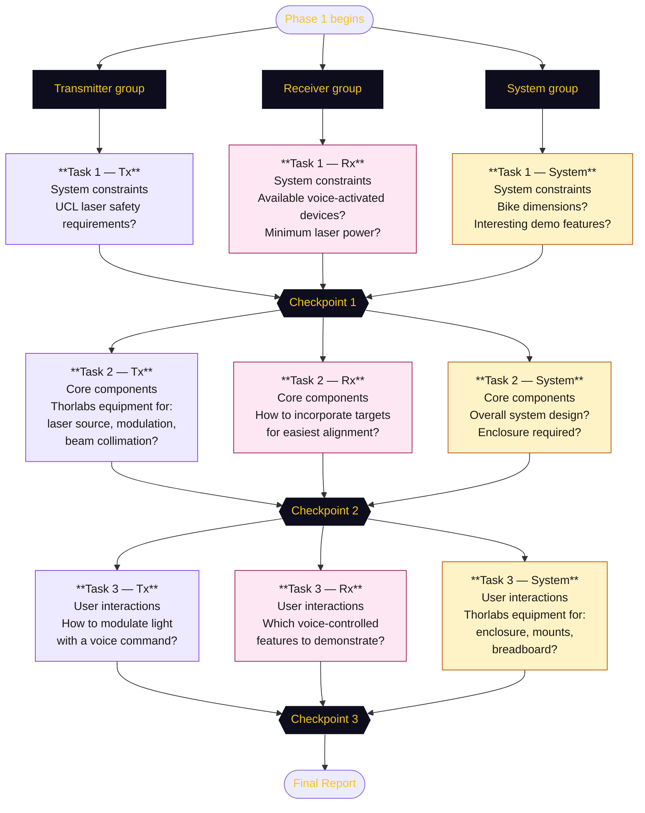
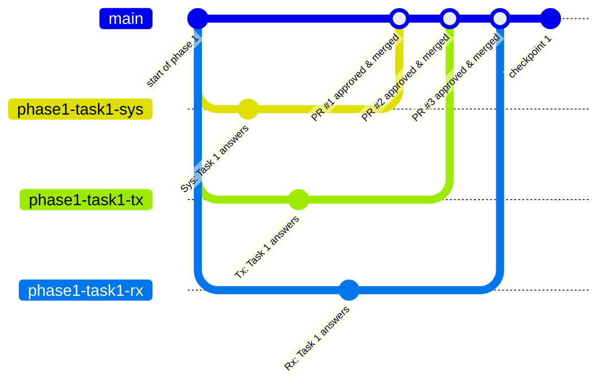

# Phase 1️⃣ — Tasks


## 🤖 Groups

Participants are split into three groups — **Transmitter**, **Receiver**, and **System** — and work in parallel across three tasks. Each task concludes with a checkpoint where all groups share progress and align on design decisions.



## 📝 Answering the tasks

Answers to each task's questions must be committed to this repository so progress is visible to everyone and the final report can be built from the documented work.

### 1. Get access to the repository

Each participant must be added as a contributor to the GitHub repository before they can push code. Ask the organiser to add your GitHub username to the repository with **Write** access:

[github.com/UCL-Photonics-Society/UCLightcommands](https://github.com/UCL-Photonics-Society/UCLightcommands)

### 2. Clone the repository

Clone the repository to your machine and move into the project folder:

```bash
git clone https://github.com/UCL-Photonics-Society/UCLightcommands.git
cd UCLightcommands
```

### 3. Branch → Commit → Pull Request

The `main` branch is [protected](https://docs.github.com/en/repositories/configuring-branches-and-merges-in-your-repository/managing-protected-branches/about-protected-branches), meaning it cannot be modified directly. Instead, the branch-based workflow for every contribution is shown below: all three groups work in parallel on their own branches, then each branch is reviewed through a [pull request](https://docs.github.com/en/pull-requests/reference/pull-requests) and merged into `main` independently.



The step-by-step for your own contribution:

1. **[Create a branch](https://docs.github.com/en/pull-requests/how-tos/commit-changes/managing-branches-within-your-repository)** from `main`, named after your task and group, e.g. `phase1-task1-tx`
    ```bash
    git fetch
    git checkout phase1-task1-tx
    ```

2. **Edit the relevant page** in `docs/` and save your changes.

3. **[Add](http://github.com/git-guides/git-pull) and [Commit](https://github.com/git-guides/git-commit)** with a short, descriptive message:
    ```bash
    git add docs/phase1/tasks.md
    git commit -m "Add Tx answers for Phase 1 Task 1"
    ```

4. **[Push](https://github.com/git-guides/git-push)** your branch to GitHub:
    ```bash
    git push -u origin phase1-task1-tx
    ```

5. **Open a [Pull Request](https://docs.github.com/en/pull-requests/reference/pull-requests)** on GitHub from your branch into `main`. Write a brief description of what you've added.

### 4. Formatting your answers

Answers are written in Markdown. If you are unfamiliar with the syntax used on this site, refer to the [MkDocs Material reference](https://squidfunk.github.io/mkdocs-material/reference/).

### 5. Review and merge

All pull requests require **organiser approval** before they can be merged into `main`. Once approved, the PR is merged and the website updates automatically via GitHub Pages.

!!! info "If main has moved on since you created your branch"
    Other groups' PRs may have been merged into `main` while you were working. Before pushing, bring your branch up to date with a rebase:

    ```bash
    git fetch origin
    git rebase origin/main
    ```

    If git reports conflicts, open the affected file, find the `<<<<<<` markers, resolve them manually, then continue:

    ```bash
    git add docs/phase1/overview.md
    git rebase --continue
    ```

    Once the rebase is clean, `git push --force-with-lease` to update your remote branch.

---

## 📚 Resources

- [Light Commands website](https://lightcommands.com/).
- [Thorlabs website](https://www.thorlabs.com/).
- [UCL Artificial Optical Radiation (AOR) Safety Standard](https://www.ucl.ac.uk/safety-services/policies/2024/feb/ucl-artificial-optical-radiation-aor-safety-standard).
- [UCL Risk Assessment Standard](https://www.ucl.ac.uk/safety-services/policies/2022/sep/risk-assessment-standard).
- [MkDocs Material reference](https://squidfunk.github.io/mkdocs-material/reference/).

---

## Task 0️⃣ — Join your group


<!-- TODO: Alert block which states that this tasks will be demoed by the organisers -->

Each group leader registers all of their group's members on the [Overview page](overview.md). Only the leader contributes to this task to avoid merge conflicts on the same file.

=== "System"

    **1. Create the branch on GitHub**

    Open the repository on GitHub, click the branch dropdown (showing `main`), type `phase1-task0-sys` in the search field, then click **Create branch: phase1-task0-sys from 'main'**.

    **2. Fetch and checkout the branch**

    ```bash
    git fetch origin
    git checkout phase1-task0-sys
    ```

    **3. Add all group members**

    Open `docs/phase1/overview.md` and replace the placeholder under the **System** tab of `## Participants` with your group's names:

    ```markdown
    === "System"

        - Alice Smith
        - Bob Jones
    ```

    **4. Commit, push, and open a PR**

    ```bash
    git add docs/phase1/overview.md
    git commit -m "Add System group members"
    git push
    ```

    Then open a Pull Request on GitHub from `phase1-task0-sys` into `main`.

    !!! warning "Wait for approval"
        The PR must be approved by the organiser before it is merged. Do not merge it yourself.

=== "Transmitter (Tx)"

    **1. Create the branch on GitHub**

    Open the repository on GitHub, click the branch dropdown (showing `main`), type `phase1-task0-tx` in the search field, then click **Create branch: phase1-task0-tx from 'main'**.

    **2. Fetch and checkout the branch**

    ```bash
    git fetch origin
    git checkout phase1-task0-tx
    ```

    **3. Add all group members**

    Open `docs/phase1/overview.md` and replace the placeholder under the **Transmitter (Tx)** tab of `## Participants` with your group's names:

    ```markdown
    === "Transmitter (Tx)"

        - Alice Smith
        - Bob Jones
    ```

    **4. Commit, push, and open a PR**

    ```bash
    git add docs/phase1/overview.md
    git commit -m "Add Tx group members"
    git push
    ```

    Then open a Pull Request on GitHub from `phase1-task0-tx` into `main`.

    !!! warning "Wait for approval"
        The PR must be approved by the organiser before it is merged. Do not merge it yourself.

=== "Receiver (Rx)"

    **1. Create the branch on GitHub**

    Open the repository on GitHub, click the branch dropdown (showing `main`), type `phase1-task0-rx` in the search field, then click **Create branch: phase1-task0-rx from 'main'**.

    **2. Fetch and checkout the branch**

    ```bash
    git fetch origin
    git checkout phase1-task0-rx
    ```

    **3. Add all group members**

    Open `docs/phase1/overview.md` and replace the placeholder under the **Receiver (Rx)** tab of `## Participants` with your group's names:

    ```markdown
    === "Receiver (Rx)"

        - Alice Smith
        - Bob Jones
    ```

    **4. Commit, push, and open a PR**

    ```bash
    git add docs/phase1/overview.md
    git commit -m "Add Rx group members"
    git push
    ```

    Then open a Pull Request on GitHub from `phase1-task0-rx` into `main`.

    !!! warning "Wait for approval"
        The PR must be approved by the organiser before it is merged. Do not merge it yourself.


---

## Task 1️⃣ — System constraints

!!! note "How to submit your answers"
    **1.** Create your branch on GitHub (branch dropdown → type name → **Create branch from 'main'**):

    | Group | Branch name |
    |---|---|
    | System | `phase1-task1-sys` |
    | Transmitter (Tx) | `phase1-task1-tx` |
    | Receiver (Rx) | `phase1-task1-rx` |

    **2.** Fetch and checkout your branch:
    ```bash
    git fetch origin
    git checkout phase1-task1-<your-group>
    ```

    **3.** Open `docs/phase1/tasks.md` in VSCode, fill in your answers in the tab below, then run a local docs preview to check rendering:
    ```bash
    code docs/phase1/tasks.md
    uv run mkdocs serve
    ```

    **4.** Add, commit, and push:
    ```bash
    git add docs/phase1/tasks.md
    git commit -m "Add <group> answers for Task 1"
    git push
    ```

    **5.** Open a Pull Request from your branch into `main` when ready. See the [rebase note](#5-review-and-merge) if `main` has moved on since you branched.

=== "System"

    !!! question "What are the dimensions of the Thorlabs Mobile Bike?"

    **Answer**

    *No answer yet.*

    ---

    !!! question "What features would be interesting and practical to demonstrate the LightCommands experiment on?"

    **Answer**

    - **Demo 1** — adjustable optical power (LED driver gain + diaphragm aperture) and beam collimation/focus, with a live oscilloscope trace, so the audience can directly see how each parameter changes the received signal-to-noise ratio.
    - **Demo 2** — ramping the laser's input power live to find the minimum activation power for a real smart device, with the target driving a connected peripheral (e.g. a smart lamp) so the audience gets an unambiguous, visible confirmation that the voice command worked.

    See the [Final Report — System Description](final-report.md#system-description) and [Pedagogical Goals](final-report.md#pedagogical-goals) for details.

=== "Transmitter (Tx)"

    !!! question "What are the UCL requirements regarding laser safety and demonstrations?"

    **Answer**

    Per [BS EN 60825-1](https://www.gov.uk/government/publications/laser-radiation-safety-advice/laser-radiation-safety-advice#fn:2) and the [UCL AOR Safety Standard](https://www.ucl.ac.uk/safety-services/policies/2024/feb/ucl-artificial-optical-radiation-aor-safety-standard), the bare laser diode used in Demo 2 (up to 60 mW CW) is a **Class 3B** emitter, so it can't be left accessible to the public. We're addressing this by treating the whole demo as a **Class 1 laser product**: the laser, driver, and beam path sit inside a fully enclosed housing with a hardware interlock (not software) that cuts power the instant the enclosure is opened, plus a laser safety panel (OD 6 at the source wavelength) facing the audience. Alignment is only ever done at minimum power using an IR detector card, never by eye, and only briefed demonstrators operate the laser. Full detail in the [Final Report — UCL Risk Assessment](final-report.md#ucl-risk-assessment).

=== "Receiver (Rx)"

    !!! question "What voice-activated devices can we have access to for the demo?"

    **Answer**

    We're targeting a commercial smart device with a MEMS microphone — a smartphone or a home assistant (e.g. Google Home) — as these are the most recognisable to a public audience. The exact model is still **TBD**; as a fallback for venues with poor network/firewall access to cloud assistants, we're also looking into a custom, locally-run audio-to-text system (e.g. on a Raspberry Pi). See the [Final Report — Receiver Parts](final-report.md#receiver-parts).

    ---

    !!! question "What is the minimum laser power required for a LightCommands experiment?"

    **Answer**

    Reported minimum activation power varies significantly by device — as low as 0.5 mW for a Google Home up to 60 mW for a Samsung Galaxy S9, at 30 cm. We're designing Demo 2 around the worst-case 60 mW scenario. See the [Final Report — Introduction](final-report.md#introduction).

---

## Task 2️⃣ — Core components

!!! note "How to submit your answers"
    **1.** Create your branch on GitHub (branch dropdown → type name → **Create branch from 'main'**):

    | Group | Branch name |
    |---|---|
    | System | `phase1-task2-sys` |
    | Transmitter (Tx) | `phase1-task2-tx` |
    | Receiver (Rx) | `phase1-task2-rx` |

    **2.** Fetch and checkout your branch:
    ```bash
    git fetch origin
    git checkout phase1-task2-<your-group>
    ```

    **3.** Open `docs/phase1/tasks.md` in VSCode, fill in your answers in the tab below, then run a local docs preview to check rendering:
    ```bash
    code docs/phase1/tasks.md
    uv run mkdocs serve
    ```

    **4.** Add, commit, and push:
    ```bash
    git add docs/phase1/tasks.md
    git commit -m "Add <group> answers for Task 2"
    git push
    ```

    **5.** Open a Pull Request from your branch into `main` when ready. See the [rebase note](#5-review-and-merge) if `main` has moved on since you branched.

=== "System"

    !!! question "What should the whole system look like?"

    **Answer**

    Both demos share the same source → driver → emitter → collimator → receiver signal chain (see the [System Description](final-report.md#system-description) diagrams):

    - **Demo 1** (LED → microphone) — an audio source drives an LED via an LED driver; the light passes through an adjustable diaphragm and a collimator before hitting a microphone/amplifier, whose output is shown on an oscilloscope.
    - **Demo 2** (laser → smart target) — an audio source drives a laser via a laser driver (gated by a hardware interlock); the collimated beam hits a smart target inside an enclosure, and the target drives a connected peripheral to show activation.

    The two setups run side by side on separate optical breadboards at opposite ends of the Mobile Photonics Lab.

    ---

    !!! question "Is an enclosure required?"

    **Answer**

    Yes, but only for Demo 2. Because the laser is driven up to the worst-case 60 mW design point (a Class 3B embedded emitter), the laser, driver, and beam path are housed in a fully enclosed, interlocked housing ([XE25C11T/M](https://www.thorlabs.com/item/XE25C11T_M)) with a laser safety panel facing the public. Demo 1 uses a low-power LED and doesn't need an enclosure. See the [Final Report — Other Parts](final-report.md#other-parts-mounts-enclosure-etc) and [UCL Risk Assessment](final-report.md#ucl-risk-assessment).

=== "Transmitter (Tx)"

    !!! question "What Thorlabs equipment can be used as a laser source?"

    **Answer**

    **Demo 2 (laser):** driver [LDC205C](https://www.thorlabs.com/item/LDC205C), with its modulation input taking a 0–5V analogue signal and its interlock pin wired to the enclosure's interlock switch. The laser diode itself is still **TBD** — it needs to reach 60 mW, and we're weighing a visible-wavelength diode (easier to align by eye) against a near-IR diode (invisible, so safer, but harder to align without an IR viewer).

    **Demo 1 (LED):** driver [CD40](https://www.thorlabs.com/4.0-a-led-driver) or the [T-Cube™ LED Driver](https://www.thorlabs.com/t-cube-tm-led-driver), also taking a 0–5V analogue modulation input, driving an [M450LP2](https://www.thorlabs.com/item/M450LP2) visible LED — chosen for the highest power reasonably achievable in order to get a good SNR at the receiver. See the [Final Report — Transmitter Parts](final-report.md#transmitter-parts).

    ---

    !!! question "What Thorlabs equipment can be used for laser modulation?"

    **Answer**

    The same driver used for each source performs the modulation, since both are analogue current drivers with a dedicated modulation input: the [LDC205C](https://www.thorlabs.com/item/LDC205C) for the Demo 2 laser, and the [CD40](https://www.thorlabs.com/4.0-a-led-driver)/[T-Cube™ LED Driver](https://www.thorlabs.com/t-cube-tm-led-driver) for the Demo 1 LED. In both cases, the audio source (microphone, recorded file, or signal generator) is fed directly into that modulation input, converting the electrical waveform into a proportional drive current that amplitude-modulates the optical output.

    ---

    !!! question "What Thorlabs equipment can be used for beam collimation / optical alignment?"

    **Answer**

    Demo 1 (LED): [SM1U25-A](https://www.thorlabs.com/item/SM1U25-A) collimation adaptor (preferably a zoom housing, to demonstrate the effect of beam focus), mounted via a [CP33/M](https://www.thorlabs.com/item/CP33_M) LED cage plate. Demo 2 (laser): [LDH56-P2/M](https://www.thorlabs.com/item/LDH56-P2_M) cage plate collimation mount, with an [SR9A-DB9](https://www.thorlabs.com/item/SR9A-DB9) strain relief cable to interface the diode to its driver. See the [Final Report — Transmitter Parts](final-report.md#transmitter-parts).

=== "Receiver (Rx)"

    !!! question "How would the targets be incorporated into the demonstration (what would make alignment easiest)?"

    **Answer**

    The target (or, for Demo 1, the MEMS microphone) needs to sit on a stage so its microphone can be positioned precisely at the laser/LED's focal point — this stage is still **TBD**. For low-power alignment, an NIR detector card ([VRC7](https://www.thorlabs.com/item/VRC7)) is used to visualise where the invisible laser beam is actually landing before bringing the target into position. See the [Final Report — Receiver Parts](final-report.md#receiver-parts) and [Other Parts](final-report.md#other-parts-mounts-enclosure-etc).

---

## Task 3️⃣ — User interactions

!!! note "How to submit your answers"
    **1.** Create your branch on GitHub (branch dropdown → type name → **Create branch from 'main'**):

    | Group | Branch name |
    |---|---|
    | System | `phase1-task3-sys` |
    | Transmitter (Tx) | `phase1-task3-tx` |
    | Receiver (Rx) | `phase1-task3-rx` |

    **2.** Fetch and checkout your branch:
    ```bash
    git fetch origin
    git checkout phase1-task3-<your-group>
    ```

    **3.** Open `docs/phase1/tasks.md` in VSCode, fill in your answers in the tab below, then run a local docs preview to check rendering:
    ```bash
    code docs/phase1/tasks.md
    uv run mkdocs serve
    ```

    **4.** Add, commit, and push:
    ```bash
    git add docs/phase1/tasks.md
    git commit -m "Add <group> answers for Task 3"
    git push
    ```

    **5.** Open a Pull Request from your branch into `main` when ready. See the [rebase note](#5-review-and-merge) if `main` has moved on since you branched.

=== "System"

    !!! question "What Thorlabs equipment can be used for the enclosure (if required)?"

    **Answer**

    [XE25C11T/M](https://www.thorlabs.com/item/XE25C11T_M) enclosure (open top, laser safety panel facing the public), fitted with a [LWxP2/M](https://www.thorlabs.com/item/LW1P2_M)-series laser safety panel (exact panel chosen for the laser's wavelength) and a hardware interlock (lever switch + 2.5 mm jack) wired into the [LDC205C](https://www.thorlabs.com/item/LDC205C) driver's interlock input. See the [Final Report — Other Parts](final-report.md#other-parts-mounts-enclosure-etc).

    ---

    !!! question "What Thorlabs equipment can be used for optical mounts?"

    **Answer**

    [CP33/M](https://www.thorlabs.com/item/CP33_M) LED cage plate mount and [SM1D12](https://www.thorlabs.com/item/SM1D12) diaphragm for Demo 1; [LDH56-P2/M](https://www.thorlabs.com/item/LDH56-P2_M) cage plate collimation mount for Demo 2's laser diode. See the [Final Report — Transmitter Parts](final-report.md#transmitter-parts).

    ---

    !!! question "What Thorlabs equipment can be used for an optical breadboard / bench?"

    **Answer**

    Two [MB4560/M](https://www.thorlabs.com/item/MB4560_M) optical breadboards, one per demo, at opposite ends of the Mobile Photonics Lab. Demo 2's enclosure needs a 525 mm × 375 mm footprint; Demo 1 could use a smaller breadboard. See the [Final Report — Other Parts](final-report.md#other-parts-mounts-enclosure-etc).

=== "Transmitter (Tx)"

    !!! question "How would the light be modulated with a voice command?"

    **Answer**

    The audio signal (from a microphone, a recorded file, or a signal generator) is fed as an analogue 0–5V modulation input directly into the LED/laser driver, which converts the electrical waveform into a proportional drive current — this amplitude-modulates the optical output power in real time, encoding the voice command onto the light itself. See the [Final Report — System Description](final-report.md#system-description).

=== "Receiver (Rx)"

    !!! question "What voice-controlled features would we like to demonstrate?"

    **Answer**

    Beyond simply activating the smart target's voice assistant, we want the target to drive a connected peripheral (e.g. a smart lamp) so the audience gets a clear, visible confirmation that the injected command worked. We'll also vary the laser's input power live to demonstrate the concept of a minimum activation power for the target. See the [Final Report — Session Description](final-report.md#session-description).
